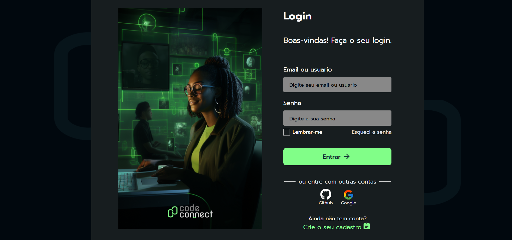

# 📌 CodeConnect - Página de Login  

Aplicação desenvolvida em **React** durante meus estudos na **Alura**, com foco em componentização, reutilização de código e boas práticas de front-end.  

A página simula um fluxo de **login moderno**, incluindo:  
- Campos para email/usuário e senha  
- Opção de "Lembrar-me"  
- Link para recuperação de senha  
- Login com contas externas (Google e Github)  

---

## 🚀 Tecnologias utilizadas  
- **React** (componentes e Hooks – useState)  
- **HTML5**  
- **CSS3**  
- **Babel** (para transpilar o JSX no ambiente local)  

---

## 🎯 Objetivo do projeto  
- Praticar a **criação de componentes reutilizáveis** (inputs, botões, títulos, textos).  
- Aprender a trabalhar com **estados** no React para capturar dados do formulário.  
- Estruturar o código de forma mais **modular e escalável**.  
- Aplicar conceitos básicos de **acessibilidade**.  

---

## 🖼️ Preview  
   

---

## ⚙️ Como executar o projeto  

1. Clone o repositório:  
   ```bash
   git clone https://github.com/seu-usuario/codeconnect-login.git

2. Abra o projeto em seu editor (VS Code recomendado).  
3. Rode a aplicação utilizando o **Live Server** ou similar, abrindo o arquivo `index.html`.  

---

## 📚 Aprendizados  

Este projeto foi essencial para consolidar meus primeiros passos em **React**, entendendo melhor sobre:  
- Como criar componentes isolados;  
- Manipular estados com `useState`;  
- Estruturar formulários de forma clara e reutilizável.  

---

## 🤝 Contribuições  

Fique à vontade para abrir issues ou enviar pull requests com melhorias!  

---

## 🧑‍💻 Autor  

**Kennedy Francisco**  
**Alura**  
🔗 [LinkedIn](https://www.linkedin.com/in/kennedy-dev-francisco/)  
🔗 [Site Alura](https://www.alura.com.br/) 
